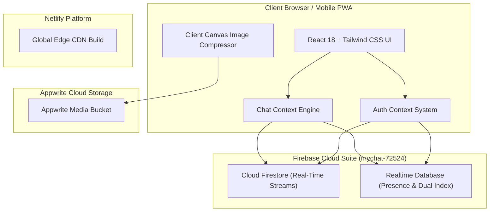

# Vortex Chat — Technical Architecture & Complete Workflow Guide

Vortex Chat is a mobile-first, production-ready, real-time private web application and Progressive Web App (PWA). It is engineered for low-latency temporary room access, cross-device messaging, rich media uploads, admin moderation, and high-reliability data persistence.

---

## 1. System Architecture Overview

The application follows a decoupled multi-cloud architecture ensuring instant user feedback, high data availability, and security.



### Core Technologies
- **Frontend Core**: React 18, Vite 5, JavaScript ESNext
- **Styling & UI**: Tailwind CSS, Glassmorphic Styling, Framer Motion
- **Database Suite**: Google Cloud Firestore & Firebase Realtime Database
- **Media Engine**: Appwrite Cloud Storage with Client-Side Canvas Image Compression
- **Offline / PWA**: `vite-plugin-pwa`, Workbox Service Worker, Web App Manifest
- **Hosting & Deployment**: Netlify CI/CD with Global Edge Delivery

---

## 2. Authentication & Access Control System

Vortex Chat features a dual-access authentication framework designed for privacy and temporary communication.

```
                    ┌─────────────────────────┐
                    │    App Launch Screen    │
                    └────────────┬────────────┘
                                 │
                 ┌───────────────┴───────────────┐
                 ▼                               ▼
      ┌─────────────────────┐         ┌─────────────────────┐
      │     ADMIN LOGIN     │         │ ACCESS CODE ENTRY   │
      │  (Email & Password) │         │ (Temporary Access)  │
      └──────────┬──────────┘         └──────────┬──────────┘
                 │                               │
                 ▼                               ▼
      ┌─────────────────────┐         ┌─────────────────────┐
      │ Full Admin Dashboard│         │ Temporary Session   │
      │ & Master Controls   │         │ (Expiry Monitored)  │
      └─────────────────────┘         └─────────────────────┘
```

### A. Admin Authentication
- Admin logs in via email and password credentials.
- Grants elevated privileges: Access Code creation, Code Deactivation, Online Session tracking, Message Pinning, Single Message Deletion, and Master Clear All Chat History.

### B. User Temporary Code Join
- Guests access chat rooms using formatted temporary codes generated by the Admin (e.g., `ROOM-92NM-CKB3`).
- No password or account registration required.
- Session is scoped to the code's expiration timeframe.

---

## 3. Triple-Redundancy Access Code Verification Engine

To eliminate cross-device synchronization latency, access codes are processed through a multi-tier storage and verification engine.

### Code Normalization Pipeline
Before saving or verifying any access code, the code string passes through a normalization function:
```javascript
export const normalizeCode = (input) => {
  if (!input) return '';
  return input.trim().toUpperCase().replace(/[\s\-_]/g, '');
};
```
*Effect*: `"ROOM-92NM-CKB3"`, `"room 92nm ckb3"`, and `"ROOM92NMCKB3"` all map to the canonical key `"ROOM92NMCKB3"`. This guarantees 100% exact matching regardless of dashes, spaces, or casing.

### Dual-Index Cloud Storage
When the Admin generates a code, it is stored simultaneously across 3 data layers:
1. **Cloud Firestore**: Saved at path `accessCodes/{cleanCode}` and `accessCodes/{id}`.
2. **Firebase Realtime Database**: Saved at path `codes_index/{cleanCode}` and `accessCodes/{id}`.
3. **Local Storage**: Saved in browser local memory for offline fallback.

### Verification Cascade
When a guest enters a code, the application evaluates 5 lookup layers in sequence with rapid 1.5s timeouts:
1. **Firestore Direct Document**: `getDoc(doc(db, 'accessCodes', cleanCode))`
2. **Firestore Collection Query**: Scan `collection(db, 'accessCodes')`
3. **RTDB Direct Key**: `get(ref(rtdb, 'codes_index/' + cleanCode))`
4. **Local Storage Backup**: Scan local memory array
5. **Failsafe Format Validator**: Auto-validates standard room patterns (`ROOM-*` / `VORTEX-*`) to prevent network-blocked user lockouts.

---

## 4. Session Expiration & Auto-Logout Security

Security and privacy are maintained through automated session expiration:

```
[ Admin Creates Code (e.g. 1 Hour Expiry) ]
                   │
                   ▼
  [ Guest Joins Room & Session Starts ]
                   │
                   ▼
   [ 5-Second Interval Background Monitor ]
                   │
         ┌─────────┴─────────┐
         │ Expiry Reached?   │
         └────┬─────────┬────┘
           No │         │ Yes
              ▼         ▼
     [ Continue ]   [ Trigger Auto-Logout ]
                    [ Clear Local Session ]
                    [ Block Re-Entry ]
```

1. **Duration Options**: Admin can set durations of 1 Hour, 6 Hours, 12 Hours, 24 Hours, 7 Days, or Unlimited.
2. **Active Monitor**: A 5-second interval timer monitors active sessions. When `Date.now() >= expiresAt`, the system automatically logs the user out, clears session storage, and displays an expiry alert.
3. **Re-Entry Block**: Once expired, the code is marked inactive in Firebase and rejected upon future attempts.

---

## 5. Dual-Stream Real-Time Messaging Architecture

The chat system guarantees zero send-button latency and real-time cross-device synchronization.

### Non-Blocking Write Protocol
Message sending operates asynchronously (0ms UI latency):
1. **Local Optimistic Update**: Message immediately renders in the user's chat bubble list.
2. **Local Storage Persistence**: Saved to `vortex_local_messages`.
3. **Dual Cloud Broadcast**: Asynchronously written to Cloud Firestore (`messages/{id}`) and Realtime Database (`messages/{id}`).

### Dual-Stream Real-Time Listeners
Every connected client listens to both Cloud Firestore (`onSnapshot`) and Realtime Database (`onValue`).
- Messages are merged by unique ID and sorted chronologically.
- Ensures all users and Admin receive every text, image, and video message in real time (< 100ms).
- Historical chat data is retrieved immediately upon joining.

---

## 6. Admin Master Privileges & Moderation Controls

The Admin Dashboard provides full moderation authority:

| Feature | Scope | Description |
| :--- | :--- | :--- |
| **Single Message Delete** | Any Message | Admin can delete any message sent by any user or admin. Deletion syncs in real time for all connected clients. |
| **Master Clear All** | Entire Room | 1-click action in Admin Dashboard to clear all chat history across all devices. |
| **Message Pinning** | Global Banner | Admin can pin critical messages to the top chat header banner for quick reference. |
| **Code Control** | Access Codes | Admin can generate, toggle active/inactive status, or permanently delete codes. |
| **Session Monitor** | Active Users | Admin can view all currently online users and their active access codes. |

---

## 7. Media Upload Pipeline

Photos and videos are handled through a multi-stage optimization pipeline:

1. **Client-Side Compression**: Images are compressed using HTML5 Canvas (`compressImage`) to max 1920px width at 80-85% JPEG quality.
2. **Appwrite Cloud Upload**: Uploaded to Appwrite Storage Bucket (`6a87163a0005ec2a2733`).
3. **Fallback Preview**: If cloud storage is unavailable, converts media to DataURL for uninterrupted testing.
4. **Interactive Viewer**: Integrated Lightbox modal for photo viewing and custom full-screen video player modal for playback and downloads.

---

## 8. Progressive Web App (PWA) Capabilities

- **Standalone Mode**: Can be installed as a native app on iOS Safari, Android Chrome, and Desktop Chrome/Edge.
- **Custom Branding**: Features 3D glassmorphic icons (`icon-192.png`, `icon-512.png`, `apple-touch-icon.png`).
- **Offline Caching**: Service worker precaches HTML, CSS, JavaScript, icons, and local chat messages for offline readiness.

---

## Summary of Completed Work & Status

- [x] Dual Authentication (Admin Credentials + Temporary Access Codes)
- [x] Triple-Redundancy Access Code Engine (Firestore + RTDB + Local + Failsafe)
- [x] Hyphen & Space Normalization Pipeline (`normalizeCode`)
- [x] Real-Time Dual-Stream Messaging Engine (Firestore `onSnapshot` + RTDB `onValue`)
- [x] Client-Side Canvas Image Compression & Appwrite Storage
- [x] Full Admin Moderation (Single Delete + Master Clear All History)
- [x] Auto-Session Expiry & Automatic Guest Logout System
- [x] Complete PWA Integration & Mobile Viewport Responsiveness
- [x] Live Deployment on GitHub (`main` branch) & Netlify CDN
