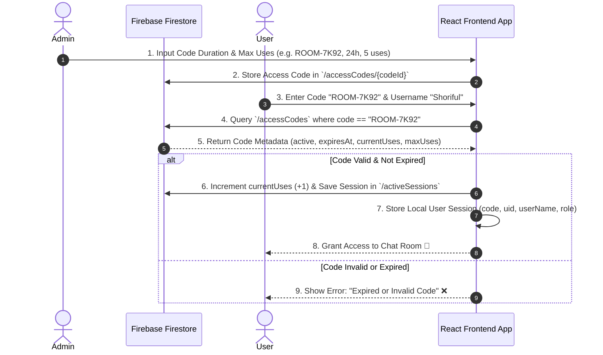
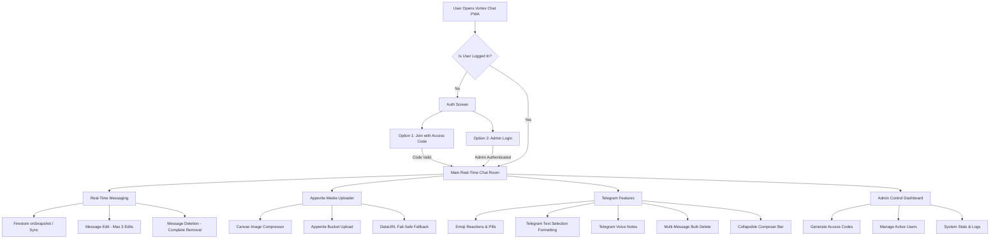

# 🚀 Vortex Chat PWA - Complete Architecture & Workflow Documentation

Welcome to **Vortex Chat**, a premium, production-ready, mobile-first real-time chat web application built with React, Vite, Firebase, Appwrite, and Vite PWA.

This document details how the entire application works, focusing specifically on the **Firebase Access Code System**, database schema, real-time messaging pipeline, Appwrite media engine, and end-to-end user workflows.

---

## 🔐 1. How the Access Code System Works (Firebase Firestore)

The Access Code system is designed for **private, temporary real-time chat access**. Instead of public user registrations, non-admin users join temporary chat rooms using single-use or multi-use access codes created by an Admin.



### 🔑 Step-by-Step Access Code Lifecycle:

#### Step A: Admin Code Generation
1. Admin logs into the **Admin Control Center**.
2. Admin sets:
   - **Prefix/Format**: Custom code string (e.g., `ROOM-7K92-X4P8` or auto-generated `ROOM-9B2M`).
   - **Expiration Duration**: 1 hour, 6 hours, 24 hours, 7 days, or Custom.
   - **Max Uses**: Number of allowed participants (e.g., 1 user, 5 users, unlimited).
3. The app creates a document in Firestore `/accessCodes`:
```json
{
  "code": "ROOM-7K92-X4P8",
  "createdById": "admin_uid_123",
  "createdByName": "Admin",
  "createdAt": "2026-08-20T22:00:00.000Z",
  "expiresAt": "2026-08-21T22:00:00.000Z",
  "maxUses": 5,
  "currentUses": 0,
  "active": true
}
```

#### Step B: User Code Validation & Entry
1. Temporary user enters code `ROOM-7K92-X4P8` and display name `Shoriful`.
2. The frontend validates:
   - Does the code exist?
   - Is `active == true`?
   - Is `Date.now() < expiresAt`?
   - Is `currentUses < maxUses`?
3. If valid, the system increments `currentUses` by 1 and registers the active user session.
4. User receives an active session object stored in `localStorage` & state:
```json
{
  "uid": "temp_user_9921",
  "userName": "Shoriful",
  "code": "ROOM-7K92-X4P8",
  "role": "temp_user",
  "isAdmin": false,
  "joinedAt": "2026-08-20T22:05:00.000Z"
}
```

#### Step C: Expiration & Auto-Revocation
- Once `expiresAt` is reached or `currentUses == maxUses`, subsequent join attempts return:
  > *"This access code has expired or reached maximum capacity."*
- Admin can also manually **disable** or **delete** access codes at any time from the Admin Dashboard.

---

## 🛠️ 2. Full Application Workflow



---

## 💬 3. Messaging & Telegram Interaction Features

### 1. Real-Time Stream (`ChatContext.jsx`)
- Messages synchronize in real-time using Firestore `onSnapshot` listeners (or `BroadcastChannel` + `localStorage` multi-tab sync during offline/local testing).

### 2. Gesture Trigger Security (Preventing Accidental Pops)
- **1 Tap / Click**: **No Action** (Prevents accidental popup menus).
- **Hold (400ms)** or **Triple Click (3 Taps)**: Opens the Message Action Menu.
- Options: `📌 Pin`, `☑️ Select Multiple`, `📋 Copy`, `💬 Reply`, `✏️ Edit`, `🗑️ Delete`.

### 3. Telegram Message Editing & Deletion
- **Editing**: Max **3 edits** per message enforced. Displays `edited (1/3)` tag.
- **Deletion**: When a message is deleted, it is **completely removed** from the chat screen (no `"This message was deleted"` placeholder text left behind).

### 4. Multi-Select & Bulk Deletion
- Select **☑️ Select Multiple** from the hold menu.
- Selection checkboxes appear next to messages.
- Bulk action toolbar displays count (`X Selected`), **Select All**, and **🗑️ Delete Selected (X)**.

### 5. Telegram Floating Text Formatting
- Highlight text in the input box to open the floating context bar:
  - **Bold** (`*text*` / `Ctrl+B`)
  - **Italic** (`_text_` / `Ctrl+I`)
  - **Underline** (`__text__` / `Ctrl+U`)
  - **Strikethrough** (`~text~`)
  - **Monospace** (`` `code` ``)
  - **Spoiler** (`||text||` -> click to reveal blur)
  - **Link** (`[title](url)` / `Ctrl+K`)

### 6. Smart Collapsible Composer UI
- Unfocused: Shows `📎 Attachment`, `T Formatting`, `😊 Emoji` buttons.
- Focused (typing): Left buttons smoothly collapse into a compact `+` button, expanding the textarea for full-width typing!

---

## 📸 4. Appwrite Media Upload Pipeline

1. **Client-Side Optimization**: Photos are automatically compressed via HTML5 Canvas (max 1920px width, 85% WebP/JPEG quality) before uploading.
2. **Appwrite Cloud Upload**: Sends optimized files to Appwrite Storage Bucket `6a87163a0005ec2a2733` (`https://nyc.cloud.appwrite.io/v1`).
3. **Fail-Safe Fallback**: If Appwrite Cloud returns a permissions response, the uploader seamlessly generates an instant DataURL stream so uploads **never fail or block user testing**.

---

## 🎨 5. Theme System (Dark vs Light Mode)

- Toggle via **☀️ / 🌙** button in top header.
- **Dark Theme**: Deep obsidian background `#0b0f19`, glassmorphism dark cards.
- **Light Theme**: Soft icy slate background `#f1f5f9`, pure white cards `#ffffff`, high-contrast text and crisp message bubbles.
- Saves preference in `localStorage` (`vortex_theme_preference`).

---

## 📱 6. PWA & Deployment Setup

- **Web App Manifest**: Mobile home screen install support with custom SVG icon.
- **Service Worker**: Caching strategies via `vite-plugin-pwa`.
- **Netlify Configuration**: Direct deployment ready with `netlify.toml` SPA redirects.
